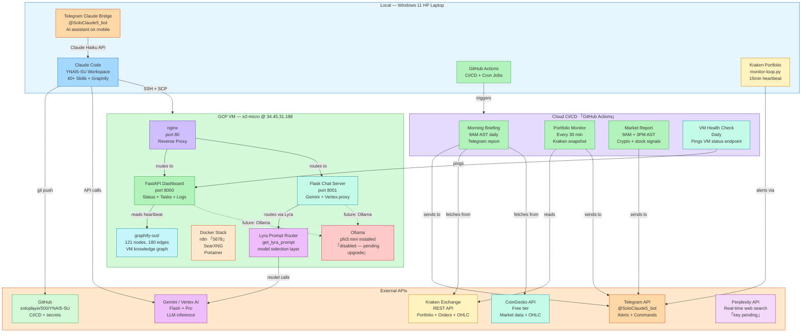

# YNAI5 Combined Infrastructure Architecture

_Generated: 2026-04-13 | Local + GCP VM + External APIs_

---

## Full Architecture Diagram

_Solid arrows = active data flows. Dashed arrows = planned/future connections._
_Renders in Obsidian, GitHub markdown, and any Mermaid-compatible renderer._

---

## Summary: How Everything Connects

### Local → Cloud
| Flow | Mechanism | Frequency |
|------|-----------|-----------|
| Local → VM | SSH/SCP | On-demand |
| Local → GitHub | git push | Per session |
| Local → Gemini API | Direct REST | Per AI task |
| Laptop alerts | monitor-loop.py → Telegram | Every 15 min (threshold) |

### GitHub Actions (Cloud CI/CD) → Everything
| Workflow | Target | Schedule |
|----------|--------|----------|
| Morning Briefing | Kraken + CoinGecko → Telegram | 9AM AST |
| Portfolio Monitor | Kraken → Telegram | Every 30 min |
| Market Report | Crypto signals → Telegram | 9AM + 3PM AST |
| VM Health Check | GCP VM /api/status | Daily |

### GCP VM → APIs
| Service | API | Purpose |
|---------|-----|---------|
| chat_server.py | Gemini/Vertex AI | LLM inference for chat |
| Lyra router | Gemini Flash → Pro → Ollama | Model tier selection |
| Dashboard | None (reads local files) | Status display |
| Scripts | GDrive backup | Session state backup |

### Key Architecture Decisions
1. **Separation of concerns:** Local = Claude Code + analysis tools. VM = persistent services + LLM proxy.
2. **Telegram as notification bus:** All async alerts (market, health, chat) route through Telegram.
3. **GitHub Actions = orchestration layer:** Not just CI/CD — it's the scheduled automation backbone.
4. **Lyra prompt routing:** VM's `get_lyra_prompt()` selects model tier dynamically (Flash → Pro → Ollama) based on task complexity and cost.
5. **Graphify on both:** Local graph (771 nodes) maps the full YNAI5-SU codebase; VM graph (121 nodes) maps the active infrastructure. Both queryable for architecture questions.

---

## Graphify Findings Summary

### Local YNAI5-SU
- **79 files, 771 nodes, 1151 edges, 71 communities**
- Top abstraction: `_cg()` — CoinGecko gateway (17 edges, everything flows through it)
- Key finding: Perplexity news bridges 3 communities (trading, music, content distribution)
- 200 isolated nodes in health-monitor — documentation gap

### GCP VM YNAI5_AI_CORE
- **14 files, 121 nodes, 180 edges, 14 communities**
- Top abstraction: `main()` in dashboard — all 10 FastAPI routes register here
- Key finding: `read_heartbeat()` is the health bus — all status checks poll it
- No surprising cross-community connections (clean architecture)
