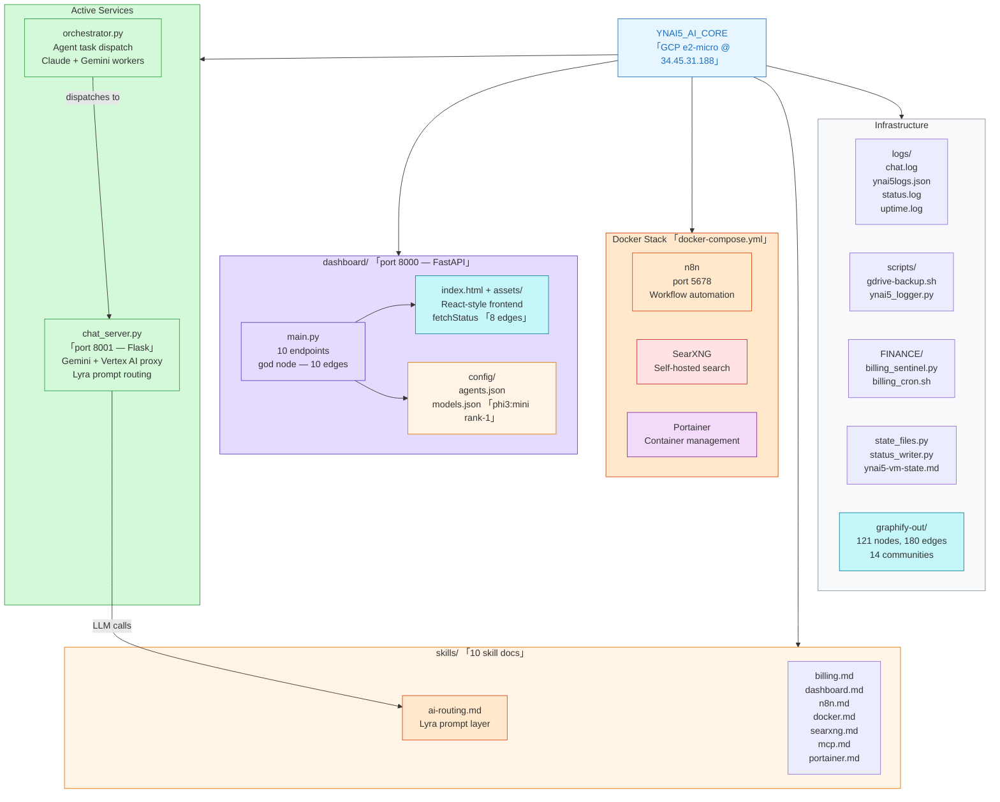

# YNAI5_AI_CORE — VM Structure & Knowledge Graph

_Generated: 2026-04-13 | GCP VM @ 34.45.31.188 (e2-micro) | Graphify v0.4.11_

---

## VM Project Structure (Mermaid)



_Renders in Obsidian, GitHub markdown, and any Mermaid-compatible renderer._

---

## Graphify VM Knowledge Graph Summary

_Source: `graphify-out/GRAPH_REPORT.md` — AST-extracted, 0 tokens used_

| Metric | Value |
|--------|-------|
| Files analyzed | 14 |
| Total words | ~15,642 |
| Graph nodes | 121 |
| Graph edges | 180 |
| Communities detected | 14 |

### God Nodes (Most Connected)

| Rank | Node | Edges | Domain |
|------|------|-------|--------|
| 1 | `main()` (dashboard) | 10 | FastAPI app entry — all routes registered here |
| 2 | `read_heartbeat()` | 8 | Health pulse reader — polled by all status checks |
| 3 | `fetchStatus()` | 8 | JS frontend status poller — drives dashboard UI |
| 4 | `main()` (chat) | 6 | Flask chat server entry |
| 5 | `get_status_compat()` | 6 | Compat endpoint — translates /api/status for metrics.js |
| 6 | `boot()` | 6 | Frontend boot — initializes all dashboard modules |
| 7 | `get_lyra_prompt()` | 5 | Lyra prompt router — AI model selection layer |
| 8 | `route_and_run()` | 5 | Chat request router — Gemini/Vertex/Ollama dispatch |
| 9 | `chat()` | 5 | Flask /chat endpoint handler |
| 10 | `get_status()` | 5 | Primary /api/status endpoint |

### Key Communities

| Community | Size | Domain |
|-----------|------|--------|
| Community 0 | 23 nodes | FastAPI dashboard — all REST endpoints, heartbeat, metrics |
| Community 1 | ~8 nodes | Chat server — Flask, Lyra prompt routing, model dispatch |
| Community 9 | ~4 nodes | JavaScript frontend — theme toggle, UI initialization |

### Surprising Connections
None detected (all connections within same source files — VM project is well-encapsulated with clear boundaries).

---

## VM Quick Reference

| Service | Port | Status | Notes |
|---------|------|--------|-------|
| FastAPI Dashboard | 8000 | Active | main.py — health, status, tasks, logs |
| Flask Chat Server | 8001 | Active | Gemini + Vertex AI proxy + Lyra routing |
| nginx | 80 | Active | Reverse proxy for both services |
| n8n | 5678 | Active | Workflow automation (via Docker) |
| SearXNG | - | Active | Self-hosted search (via Docker) |
| Portainer | - | Active | Container management |
| Ollama | 11434 | Disabled | phi3:mini installed — enable when ready |

---

## Graphify Permanent Install on VM

```bash
# Rebuild graph after code changes:
export PATH=$PATH:/home/shema/.local/bin
cd ~/YNAI5_AI_CORE && graphify update .

# Query the graph:
graphify query "your question"

# Explain a node:
graphify explain "main()"
```

PATH is permanently added to `~/.bashrc`.
