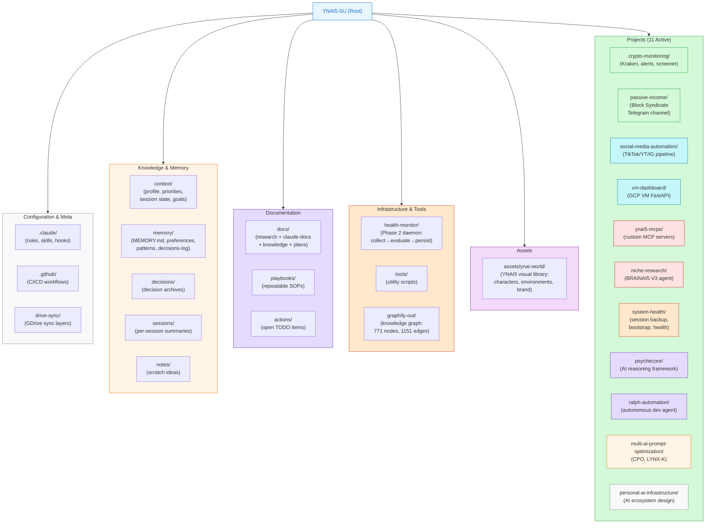

# YNAI5-SU Workspace Knowledge

_Generated: 2026-04-13 | Graphify v0.4.11 + Mermaid Visualizer skill_

---

## YNAI5-SU Folder Structure

_Renders in Obsidian (graph view), GitHub markdown, and any Mermaid-compatible renderer._

---

## Graphify Knowledge Graph Summary

_Source: `graphify-out/GRAPH_REPORT.md` — AST-extracted, 0 tokens used_

| Metric | Value |
|--------|-------|
| Files analyzed | 79 |
| Total words | ~172,133 |
| Graph nodes | 771 |
| Graph edges | 1,151 |
| Communities detected | 71 |

### Core Abstractions (God Nodes — Most Connected)

| Rank | Node | Edges | Domain |
|------|------|-------|--------|
| 1 | `_cg()` | 17 | CoinGecko price fetcher (crypto monitoring) |
| 2 | `get_portfolio_summary()` | 13 | Kraken portfolio aggregator |
| 3 | `_get()` | 13 | Generic HTTP getter (music/media MCP) |
| 4-8 | `main()` (×5) | 10–12 | Entry points across 5 different scripts |
| 9 | `full_technical_analysis()` | 10 | Trading signals MCP |
| 10 | `save_backup()` | 9 | Session backup engine |

### Key Functional Communities

| Community | Size | Domain |
|-----------|------|--------|
| Community 0 | 66 nodes | Trading signals — Kraken, technical analysis, indicators |
| Community 2 | 29 nodes | Kraken portfolio — balance, orders, price monitoring |
| Community 5 | 27 nodes | Content distribution — cross-platform formatting, social media |
| Community 6 | 26 nodes | Block Syndicate — crypto/stock screener signals |
| Community 7 | 22 nodes | VM Dashboard — FastAPI, service status, logs |
| Community 8 | 22 nodes | Session Backup Engine — compact/stop/start hooks |
| Community 16 | 12 nodes | Health Monitor daemon — Windows laptop metrics |
| Community 20 | 12 nodes | Kimi Swarm — parallel K2.5 agent dispatch |

### Surprising Connections Found by Graphify
- Kraken order book → content distribution formatter (`format_for_platform`)
- Perplexity news fetcher → Genius music search (`get_artist_songs`)
- Perplexity news → Kraken balance check (unified news-to-finance bridge)
- OHLC candle data → trading signals computation (direct pipeline link)

### Knowledge Gaps (200 isolated nodes)
Most isolated nodes are in the health-monitor subsystem — components that need better cross-linking or documentation to show their role in the broader architecture.
